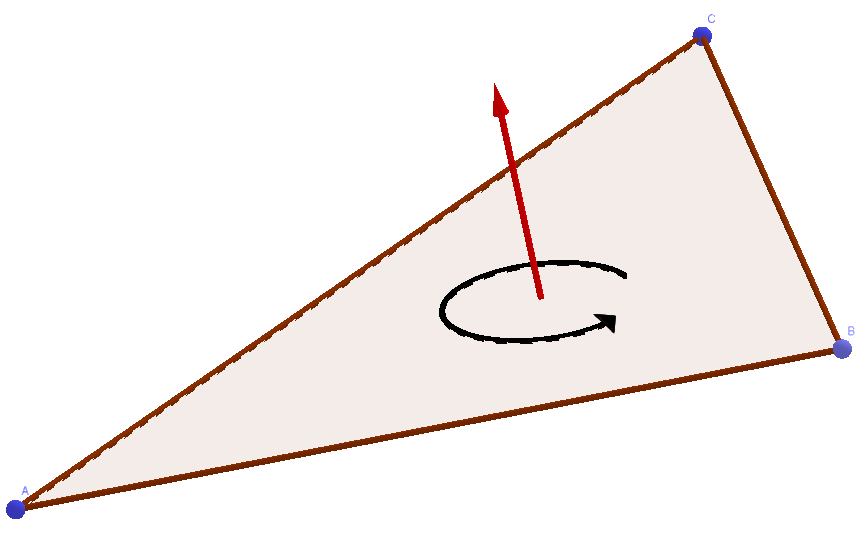
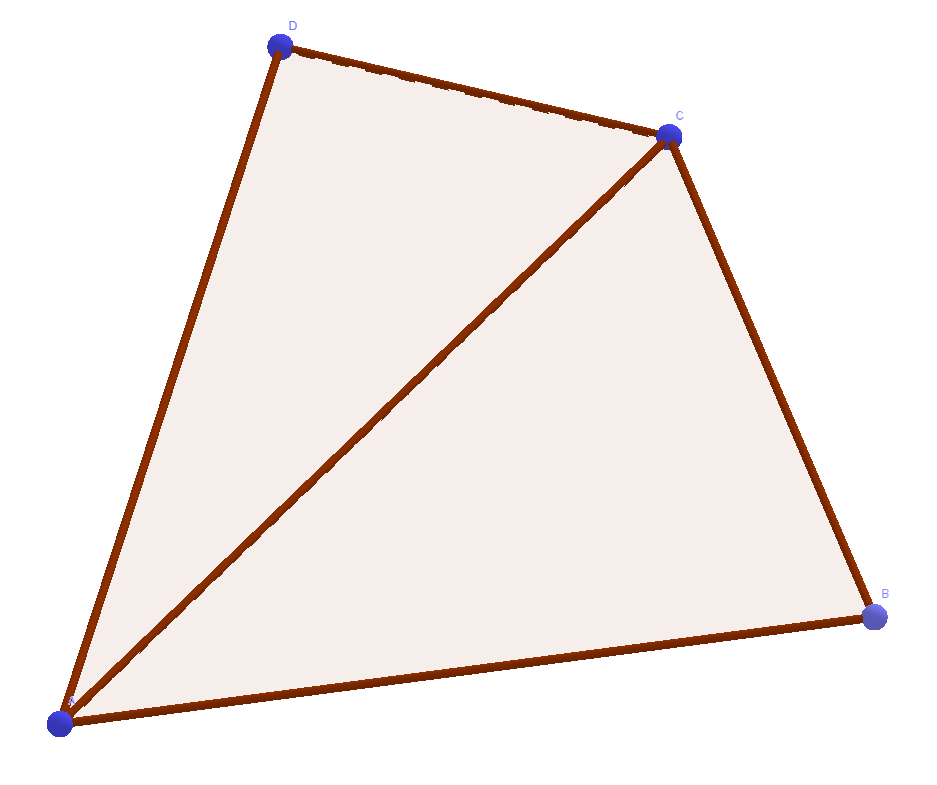
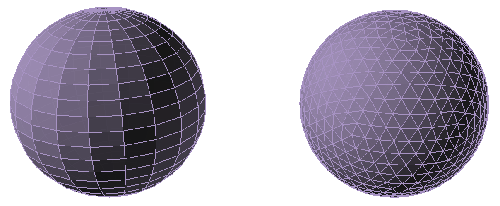
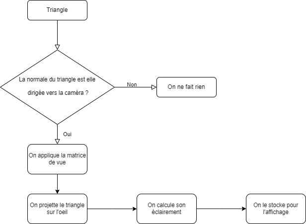
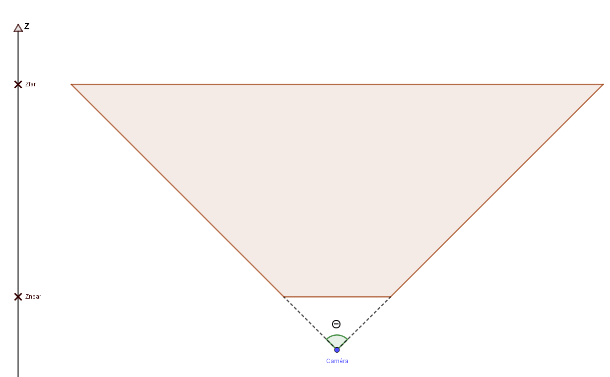
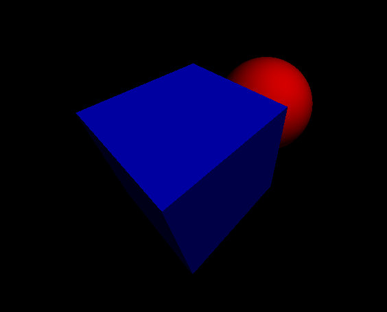

<h4 align="center">Projet de Programmation avancée et Projets :</h4>
<h1 align="center">Moteur 3D</h1>
<h4 align="center">Benjamin FARIGOUL & Hugo PIERRON, Décembre 2022</h4>


## Introduction

### Présentation du projet
Le projet consistait en la création d'un moteur 3D en c++ avec la bibliothèque SDL. Cette bibliothèque permet l'affichage, de lignes, de points, de triangles et de toute autre figure géométrique en 2 dimensions.
Ainsi, nous avons dû créer un ensemble d'objets en 3 dimensions tels que des points, des triangles, des quadrilatères, des cubes et des sphères. 
Le projet devait aussi contenir une caméra depuis laquelle afficher les différents objets.

<figure>
    
    <figcaption>Figure 1 : Diagramme UML du projet (sans le fichier main)</figcaption>
</figure>


### Manuel d'utilisation
Il existe plusieurs modes de rendu de notre projet. 
Le mode Lit, le mode Unlit, le mode Wireframe et le mode Animation. Certains de ces modes sont indépendants des autres (il est par exemple possible d'être en mode Lit et Wireframe tout en ayant l'animation).

Le mode Lit correspond à un rendu comprenant une source lumineuse qui va ainsi créer des ombrages sur les objets.

Le mode Unlit lui va au contraire appliquer une seule couleur sans nuance sur l'objet.

Le mode Wireframe peut être activé ou non. S'il l'est, les arrêtes des quadrilatères seront apparentes.

Enfin, le mode animation permet d'animer ou non la scène.

<figure>
    
    <figcaption>Figure 2.1 : Mode Lit</figcaption>
    
    <figcaption>Figure 2.2 : Mode Lit et Wireframe</figcaption>
    
    <figcaption>Figure 2.3 : Mode Unlit</figcaption>
    
    <figcaption>Figure 2.4 : Mode Unlit et Wireframe</figcaption>
    <figcaption>Figure 2 : Comparaison des différents modes de rendu</figcaption>
</figure>


Après avoir compilé notre projet et obtenu l'executable, il est possible de l'utiliser avec ou sans arguments afin de choisir les modes de rendu.

Le cas par défaut, sans argument, va afficher la scène en mode Lit, Wireframe et sans animation.
Le premier argument correspond au mode de rendu visuel :
- **L :** Lit sans Wireframe.
- **LW :** Lit avec Wireframe.
- **U :** Unlit sans Wireframe.
- **UW :** Unlit avec Wireframe.
- **anim :** Cas par défaut avec l'animation.

Il est possible d'ajouter **anim** en second argument afin de voir l'animation avec le mode de rendu choisi.
\newline
\newline
Il est égalemement possible de modifier rapidement et facilement les paramètres suivants depuis la fonction **main** :
- Epaisseur des lignes du mode Wireframe
- Couleur des lignes du mode Wireframe
- Couleur du pavé
- Le nombre de subdivisions de la sphère (plus ce nombre est élevé, plus la sphère semble lisse mais le nombre de triangle augmente de manière quadratique ce qui diminue le performances lors de l'animation)
- Couleur de la sphère
- Position de la source de lumière
- Intensité lumineuse de la source

Il est aussi possible de modifier l'angle de vue de la caméra, il suffit pour cela de modifier les vecteurs suivants dans les constructeurs de l'objet Scene:
- upDirection : pour savoir où se trouve le haut de la caméra
- lookDirection : pour savoir dans quelle direction regarder
- cameraPosition : pour la position de la camera


## Classes de bases

### Les Vector3
Les points sont des vector3 et été la première pierre apportée au projet. Ils sont la base de toutes les figures 3D du projet.

Ils sont composés de 4 flottants : 3 pour les coordonnées et 1 pour l'homogénisation de celles ci lors des projections.

La classe de ces points comporte un constructeur simple ainsi que des getters et setters.

Nous avons aussi ajouté à cela des opérateurs : += , -=, *=, /=, +, -, *, /. ainsi que des fonctions telle que la normalisation, le produit scalaire et le produit de vecteur (car nos points sont semblables à des vecteurs, nous utilisons d'ailleurs les deux interprétations sans différence)

### Les triangles
Les Triangles sont la base des figures 3D. Ils sont composés de trois points 3D et d'une couleur. A cela s'ajoute un constructeur par défaut, initialisant tous ses points sur l'origine et un constructeur prenant en argument trois points. Pour faire ce projet, il a fallu orienter les triangles dans le sens trigonométrique afin de pouvoir les afficher correctement ensuite. 

<figure>
    
    <figcaption>Figure 3 : Triangle orienté dans le sens trigonométrique. La flèche représente la normale</figcaption>
</figure>


Enfin à cela s'ajoutent les getters et setters de chaque point et de la couleur ainsi qu'une méthode retournant le milieu du côté AC. Celle-ci est utile afin de déterminer la couleur à afficher en mode Lit (voir La scene).

### Les quadrilatères
Les quadrilatères sont composés de deux triangles et d'une couleur ainsi que trois constructeurs. Un par défaut, un prenant en argument deux triangles coplanaires, devant partager deux sommets en communs, et une couleur et un prenant en argument quatre Vector3, correspondants aux quatres points coplanairers du quadrilatère et devant être donné dans le sens trigonométrique, et une couleur.

<figure>
    
    <figcaption>Figure 4 : Quadrilatère contenant deux triangles</figcaption>
</figure>


La classe contient également des getters pour chaque attribut. 

### Les volumes3D
La classe Volume3D est une classe générique pour tous les volumes en 3 dimensions. Elle permet à la scene d'avoir une liste d'objets à rendre sans avoir à donner la classe de chaque objet rendu. Ainsi, elle ne contient qu'un vecteur de quadrilatère, une couleur d'affichage ainsi qu'une fonction donnant accès aux quadrilatères.

### Les pave3D
Les Pave3D sont une sorte de Volume3D, ils sont composés de 6 faces qui sont des quadrilatères et d'une couleur. Nous avons mis en place un constructeur avec un vecteur de quadrilatères et une couleur, un constructeur de copie et un dernier constructeur avec les 8 points du pavé ainsi que la couleur.

### Les sphere3D
Les sphères sont un assemblage de quadrilatères. Chaque quadrilatère étant composé des deux triangles, il existe 2 principaux moyens de faire des spheres en 3 dimensions. La première est une icosphère, qui est un assemblage de triangles homogènes mais sans quadrilatère.  L'autre manière est d'utiliser la longitude et la latitude sur une sphere afin de faire des arceaux tous perpendiculaires à l'axe Nord-Sud de la sphere. Ce qui fait une sphere composée de rangées de quadrilatères avec des triangles aux pôles.

<figure>
    
    <figcaption>Figure 5 : Différentes manières de faire un maillage de sphere. L'icosphere est à droite.</figcaption>
</figure>


Nous avons choisi la deuxième manière de faire car elle plus simple à mettre en oeuvre et qu'elle est composée de quadrilatères. Nous avons cependant eu quelques difficultés sur la mise en oeuvre de cette sphère. Au départ nous avions placé un nombre insuffisant de points pour les quadrilatères de la sphère. Il a donc fallu créer certains points en double afin de compléter le tour de la sphère à chaque rangée. Par exemple les faces qui semblent triangulaires aux pôle nord et sud de la sphère sont en réalité des quadrilatères dont deux points se superposent sur le pôle.

Le constructeur de la sphère est alors simplement composé d'un point pour le centre, d'un flottant pour le rayon, d'un nombre de segments correspondant au nombre de subdivisions transversales et longitudinales et d'une couleur. 

<figure>
    
    <figcaption>Figure 6 : Représentation choisie de la sphere.</figcaption>
</figure>


### La scene
La scène est l'objet contenant tout ce qui servira à l'affichage par la suite. Elle contient un ensemble de Volume3D, la position de la caméra, des vecteurs servant à la caméra, un point pour la source de lumière, un flottant pour l'intensité de la lumière, deux booléens pour les modes de rendus, un entier pour l'épaisseur des lignes, une couleur pour les lignes et un booléen pour animer ou non la scène.

Scene comporte aussi un constructeur par défaut (avec des valeurs fixées arbitrairement donc peut utilisable en pratique) et un constructeur où l'on fourni tous les arguments de la scene.
La scene est principalement un objet de stockage, donc ses seules méthodes sont des getters et des setters.

### L'affichage
L'affichage est la classe permettant d'utiliser la SDL dans notre projet. Elle contient un pointeur vers une fenêtre, un pointeur vers un renderer, un tableau de couleurs (pour chaque pixel de l'écran), un pointeur vers un buffer de textures (utile pour le rendu), deux entiers correspondants à la taille de la fenêtre et enfin un booléen pour savoir si la fenêtre est ouverte ou non.

La classe contient également deux méthodes pour le rendu qui sont **render_color_buffer** qui permet de créer une texture pouvant être affichée lors du rendu. La fonction **clear_color_buffer** a aussi été créée pour remettre à zéro l'écran (à chaque rendu d'image par exemple).

Et enfin les méthodes **render** et **drawTriangle** qui permettent respectivement de calculer le rendu de chaque triangle et le dessin des triangles. Ce dessin utilise la fonction **fillTriangle** pour la rasterisation que nous développerons dans les parties suivantes.

Pour expliquer plus précisément le fonctionnement de la méthode **render**, celle-ci parcourt chaque triangle présent dans la scène et vérifie s'il doit être affiché. Si oui, c'est à dire si sa normale est orientée vers la caméra, alors on calcule sa position par rapport à la caméra 
 et on effectue sa projection sur un plan correspondant à l'oeil. C'est aussi cette méthode qui permet de calculer l'éclairement des faces à afficher. Nous développeront également ce point dans les parties suivantes. Une fois la liste des triangles projetés à afficher ainsi que leurs informations (couleur, éclairement, position sur l'écran) nous les dessinons en partant du fond ce qui permet de ne pas avoir de problèmes d'affichage si un objet est devant un autre.

<figure>
    
    <figcaption>Figure 7 : Pipeline d'affichage d'un triangle.</figcaption>
</figure>


## Rasterisation
Pour colorier les faces, nous procédons à une rasterisation, c'est à dire, d'après la définition du dictionaire, convertir une image vectorielle en image matricielle afin de l'afficher sur un écran. Concrétement, l'image matricielle est l'écran qui est une matrice de pixels. L'image vectorielle, c'est le triangle projeté qui est défini par trois points en deux dimensions (des **SDL_Point** dans le cas de notre projet). L'objectif est donc de remplir les lignes du triangles une à une. Pour cela, nous avons utilisé l'algorithme de Scanline.

Explication de l'algorithme en général :

1. Trier les sommets de la forme fermée par ordre croissant de leur coordonnée y. Cela permet de parcourir les lignes de la forme de haut en bas, de la manière la plus efficace possible.
2. Déterminer la zone de remplissage de chaque ligne en utilisant des coefficients de proportionnalité. Pour chaque ligne, il faut :
2.1 Calculer les coefficients de proportionnalité alpha et beta, qui vont permettre de déterminer les coordonnées A et B des points qui délimitent la zone de remplissage de la ligne courante. Alpha représente la proportion de la hauteur totale de la forme parcourue, tandis que beta représente la proportion de la hauteur du segment courant parcourue.
2.2 Calculer les coordonnées A et B en utilisant les coefficients de proportionnalité et les coordonnées x des sommets de la forme.
2.3 Parcourir la ligne de A à B en dessinant chaque pixel de la zone de remplissage.


Ainsi après avoir trié les sommets de haut en bas par rapport à l'écran, nous traçons une ligne horizontale pixel par pixel entre les extrêmités gauche et droite précédement calculées avec les coefficients de proportionnalité.


## Projection et Caméra
La projection est le coeur du fonctionnement de l'affichage, elle permet de transformer une scene 3D en des coordonnées 2D affichable. La projection fonctionne avec le schéma suivant :

<figure>
    
    <figcaption>Figure 8 : Schéma de la projection.</figcaption>
</figure>


Cette image est un schéma en deux dimensions, l'axe horizontal est l'axe X. La figure de projection est alors un prisme.

On peut ainsi voir que chaque point se trouvant dans le trapèze va être être projeté sur l'écran et tout point en dehors ne s'affichera pas. L'angle $\theta$ représente le FOV (Field of View), il peut être modifié pour avoir un vue plus large ou resserrée. Les valeurs $Zfar$ et $Znear$ représente respectivement la distance maximale de vue d'un objet et la distance minimale.
Pour projeter un point sur l'écran, on mutliplie alors le vecteur Point par une matrice de projection $P$ issu de la figure : 

```math
\begin{bmatrix} \frac{h}{l}\cdot\frac{1}{\tan\left(\frac{\theta}{2}\right)} & 0 & 0 & 0\\0 & \frac{1}{\tan\left(\frac{\theta}{2}\right)} &0 & 0 \\0 & 0 & \frac{Zfar}{ZFar-Znear} & 1\\0 & 0 & -\frac{ZFar*ZNear}{ZFar-ZNear} & 0\end{bmatrix}
```

Où $h$ est la hauteur de l'écran en pixels, $w$ la largeur de l'écran en pixels et  $\theta$ est le FOV en radian.
La matrice étant de taille 4, il a donc fallu ajouter une valeur $w$ au vecteur Point. Cette valeur permet une homogénisation des coordonnées après calculs.

Pour la caméra, il fallait aussi trouver une matrice adaptée. Ainsi, il a fallut définir 4 vecteurs dans la scene : un point désignant le centre de la caméra, un vecteur direction correspondant à la direction vers laquelle regarde la caméra, un vecteur qui pointe vers le haut (pour l'orientation de la caméra) et un point désignant la cible de la caméra. La cible et la direction du regard sont liés mais nous avons besoin des deux pour effectuer les calculs.
Pour la matrice, il faut avoir les vecteurs suivants : 

- Un vecteur correspondant au haut (up) : 
```math 
\begin{pmatrix}
Ux\\ 
Uy\\ 
Uz\\ 
\end{pmatrix}
```
- Un vecteur correpondant à la droite (right) :
```math
\begin{pmatrix}
Rx\\
Ry\\
Rz\\
\end{pmatrix}
```
- Un vecteur allant vers l'avant (forward) :
```math
\begin{pmatrix}
Fx\\
Fy\\
Fz\\
\end{pmatrix}
```
- Un vecteur pour la position de la caméra : 
```math
\begin{pmatrix}
Px\\
Py\\
Pz\\
\end{pmatrix}
```

La matrice de Caméra $C$ se forme alors ainsi :
```math
\begin{bmatrix}
Rx & Ry & Rz & 0\\
Ux & Ux & Uz & 0\\
Fx & Fy & Fz & 0\\
Px & Py & Pz & 1
\end{bmatrix}
```

Chaque point en 3 dimensions est alors multiplié par la matrice $C$ puis multiplié par la matrice de projection $P$ pour être affiché. On divise ensuite ses coordonnées par le coefficient $w$ pour homogénéiser. On obtient alors des valeurs flottantes entre -1 et 1 qui permettent ensuite l'affichage sur un écran en ajoutant 1 et en multipliant par $\frac{h}{2}$ pour Y et par $\frac{l}{2}$ pour X. 

Malgré la multiplication des calculs, certains objets s'affichent lorsqu'ils passent derrière la caméra. De nombreux essais ont été fait pour tenter de régler le problème mais le bug est resté. La caméra n'est donc pas mobile et lors de l'initialisation, il faut éviter de placer la caméra dans un sens qui conduirait à un problème.


## Gestion de la lumière
La gestion de la lumière, visible dans le mode Lit n'est pas une gestion réaliste utilisant le raytracing. En effet, dans le raytracing, des rayons partent dans tous les sens de la source lumineuse jusqu'aux objets environnants. Ici c'est l'inverse, le rayon $lightRay$ part du centre d'une face quadrilatères en direction de la source de lumière. Il n'y a ainsi qu'un seul rayon à calculer. Il nous donne la distance $d$  séparant la face de la source. 
Pour déterminer si la face est éclairée ou non, nous effectuons un produit scalaire entre le vecteur $lightRay$ et la normale $n$ de la face. Soit $\vec{n}$ le vecteur de la normale et $\vec{lr}$ le vecteur $lightRay$. Nous pouvons alors obtenir l'angle $\theta$ entre ces deux veteurs suivant la formule suivante :

```math
   \theta = arcos(\frac{\vec{n} \cdot \vec{lr}}{\lVert \vec{n} \rVert * \lVert \vec{lr} \rVert})
```

Enfin, en notant $I$ l'intensité de la source lumineuse obtenue avec **scene.getIntensite()**, nous obtenons l'éclairement du triangle grâce à la formule physique 

```math
    E = \frac{I}{d^2}cos(\theta)
```

Les paramètres par défaut de l'intensité, égal à 20.0, et de la positon de la source nous donnent des valeurs entre 0 et 1.2, c'est pourquoi nous contraignons les valeurs au dessus de 1 à être égales à 1 et les valeurs inférieures à 0.1 à être égale à 0.1. De cette façon, aucune face n'est jamais invisible et reste dans la couleur choisie.
En effet, cet indice d'éclairement et ensuite multiplié par les composantes R, G et B de la couleur du triangle. Ainsi plus l'éclairement est grand, plus la face sera de la couleur réelle de l'objet, plus l'éclairement est petit, plus la face est dans l'ombre. Cela se remarque particulièrement sur la sphère.
\newline
\newline
Il est à noter que les objets ne génèrent pas d'ombre avec cette méthode. Il faudrait pour cela vérifier qu'aucun obstacle n'est présent entre la face et la source et dans le cas contraire assigner un éclairement de 0.1 à la face. De plus la source ne possède pas de couleur, c'est une source de lumière blanche. Pour faire une source de couleur il faudrait multiplier les couleurs pour obtenir un rendu un peu plus réaliste (un objet blanc éclairé par une lumière rouge apparaît rouge).

<figure>
    
    <figcaption>Figure 9 : Rendu final.</figcaption>
</figure>